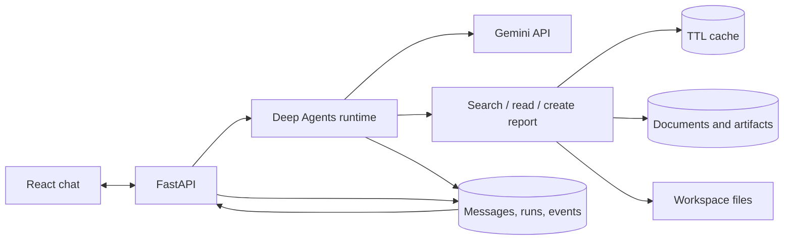

# Agentic App 101

A full-day workshop and a runnable **document chat agent** built with **React, FastAPI, Deep Agents and Gemini**.

Ask questions about three fictional regional reports, watch tool activity, and generate a downloadable briefing. The app includes streamed responses, saved conversations, document upload, Markdown previews, cancellation and reconnect support.

## Quick start — Python only

Install **Python 3.11+**. Clone with Git, or [download the ZIP](https://github.com/plc1220/agentic-app-101/archive/refs/heads/main.zip) and extract it:

```bash
git clone https://github.com/plc1220/agentic-app-101.git
cd agentic-app-101
cp .env.example .env
```

On Windows, use `copy .env.example .env` in Command Prompt, or `Copy-Item .env.example .env` in PowerShell.

Edit `.env`:

```dotenv
GEMINI_API_KEY=your_key_from_google_ai_studio
GEMINI_MODEL=gemini-3-flash-preview
AGENT_MODE=gemini
```

Get a key from [Google AI Studio](https://aistudio.google.com/apikey). Use a model available to your project. Selected models offer a free tier, subject to project tier and quota; see [pricing](https://ai.google.dev/gemini-api/docs/pricing). Use the included fictional data when learning.

Start the app:

| Platform | Command |
|---|---|
| macOS / Linux | `bash run.sh` |
| Windows Command Prompt | `run.bat` |
| Windows PowerShell | `.\run.bat` |

Open **http://127.0.0.1:8000**. Stop the server with Ctrl+C.

The launcher creates `.venv`, installs the Python packages, and starts the backend. A prebuilt React frontend is included, so **Node.js, Docker and database installation are not required for this path**. Internet access is needed for dependency installation and Gemini requests. No cloud CLI login or service-account file is needed.

If `.env` is absent, the launcher creates it and stops so you can add the key. If an older workshop `.venv` uses Python 3.10, move that environment aside and rerun with Python 3.11+.

### Offline walkthrough

Set `AGENT_MODE=sample` and restart. This mode uses the same UI, tools, storage, streams and artifacts with **scripted responses and no model calls**. It is visibly labelled Sample and is useful for demonstrating the app when API access is unavailable. The first package installation still needs internet access.

## Try these prompts

1. **Compare the three regional reports. Highlight differences in cost assumptions and cite your sources.**
2. **What should the South team clarify before we compare its budget with North?**
3. **Create a one-page briefing as a downloadable Markdown report. Include a comparison, open questions and source links.**

Open the report in **Artifacts**, then download it. You can also upload UTF-8 `.txt` or `.md` documents up to 1 MB. This tutorial does not parse PDFs.

## Components you can see

| Component | Default local launch | Docker Compose |
|---|---|---|
| Frontend | Prebuilt React + TypeScript | React assets served by Nginx web container |
| API | FastAPI + Uvicorn | Separate API container |
| Agent | Deep Agents + Gemini in the backend process | Separate agent container |
| Database | SQLite in `.data/workshop.db` | PostgreSQL |
| Object storage | Key-addressed files in `.data/objects/` | MinIO (S3-compatible) |
| File storage | Per-run staging files in `.data/workspaces/` | Agent workspace volume |
| Cache | Bounded in-memory cache with 5-minute expiry | Redis with 5-minute expiry |
| Streaming | Server-sent events (SSE), persisted event IDs | Same protocol, forwarded through Nginx |
| Skill | `skills/briefing/SKILL.md` loaded into agent state | Same skill |

The local object store is a filesystem adapter with `put/get` operations; it does not claim to be a cloud storage service. Redis is used as a **cache**, not a queue, in this implementation. API-to-agent dispatch uses internal HTTP; run state and replay events are stored in the database.



## Optional: run the containers

Install Docker with Compose. Keep the same `.env` file, then run:

```bash
docker compose up --build
```

Open **http://127.0.0.1:8080**. Only the web service publishes a port, bound to loopback. Stop with `docker compose down`; named volumes retain data. The example database, object-store and internal-worker credentials in `compose.yaml` are **local tutorial defaults**.

This is a single-worker teaching app. It is not a public multi-user deployment: browser sessions isolate records, but there are no user accounts, organization access policies, production migrations, distributed job scheduler, or production retention policy. Add those before deploying beyond a trusted local workshop. Runs interrupted by a server/worker restart are marked failed; they are not silently re-executed.

## Source tour

```text
frontend/src/           React chat, stream consumption, activity and artifact UI
backend/main.py         FastAPI routes, browser sessions, run submission, SSE
backend/agent.py        Deep Agents + Gemini, tools, stream event mapping
backend/database.py     SQLAlchemy models: conversations, runs, events and files
backend/storage.py      Object storage adapter, workspace files and TTL cache
backend/static/         Committed production frontend build
skills/briefing/        A reusable document-briefing skill
sample-documents/       Fictional reports for the demo
infra/                  Dockerfile and Nginx streaming proxy
compose.yaml            Web + API + agent + PostgreSQL + Redis + MinIO
launch.py               Local server entry point
run_agent.py            Original optional terminal example
```

## Develop the frontend

Install Node.js 22.12+ (24 recommended) only if editing React:

```bash
npm ci --prefix frontend
npm run dev --prefix frontend
```

Run the Python backend separately with `bash run.sh`. Vite proxies `/api` to port 8000. Rebuild the distributable frontend after changes:

```bash
npm run build --prefix frontend
```

Commit the updated `backend/static/` files with the source. `frontend/package-lock.json` locks the frontend dependency tree. Major Python integrations are pinned in `requirements.txt`; `requirements-lock.txt` records the resolved Python environment used while building this version.

## Workshop materials

- `agentic-app-101.html`: self-contained slide deck. Arrow keys navigate; **O** opens the overview; **N** opens notes.
- `facilitator-runbook.md`: agenda and speaker notes.
- `demo-walkthrough.md`: presentation sequence and code tour.
- `stack-and-setup.md`: setup details and troubleshooting.
- `streaming-and-artifacts.md`: event contract, rendering and recovery.
- `typical-app-scaffold.md`: repository structure and responsibilities.
- `sources-and-frameworks.md`: official learning references.
- `exercises.md`: group activities.

To serve the slides separately: `python3 -m http.server 8765 --bind 127.0.0.1`, then open `http://127.0.0.1:8765/agentic-app-101.html`. Rebuild slides and notes with `python3 deck/build.py`.

## Implementation boundaries

- Gemini mode runs the actual Deep Agents framework. Sample mode is an explicitly scripted fallback.
- The application exposes search, read and report-creation tools. Deep Agents also has an ephemeral virtual filesystem; it does not get unrestricted host filesystem or shell access.
- A run has a 180-second timeout, graph recursion limit, and output-length limit. Cancellation is cooperative; it cannot reverse a file already saved or guarantee reversal of provider billing.
- Final messages, partial responses and events are persisted. Refreshing the browser reconnects to an active run and replays its events.
- The last 24 stored messages are supplied as bounded conversation context; this is not unlimited memory or durable recovery of a half-executed LangGraph checkpoint.
- Generated Markdown renders without raw HTML. Uploaded files and model output are untrusted content.
- MCP and advanced multi-agent orchestration remain workshop reference topics; no MCP server is needed to run this app.
- Frontend builds were produced during implementation. Live Gemini calls, launcher tests and Docker integration tests were not run as part of this change.

Keep `.env`, `.data`, and API keys out of Git. See the MIT [license](LICENSE).
